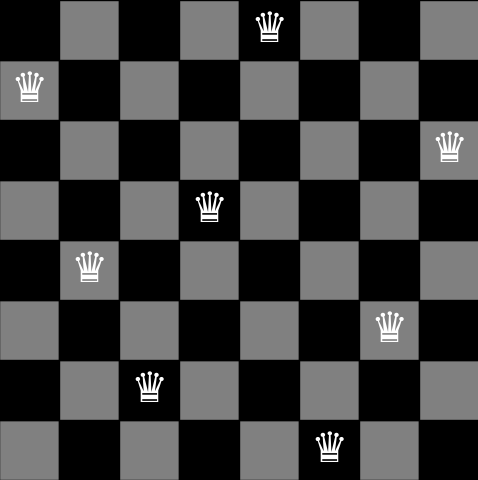
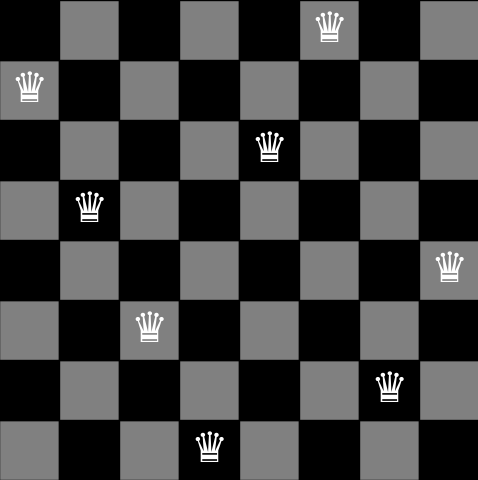
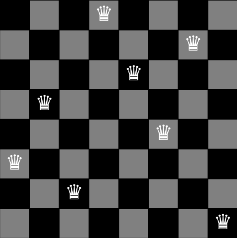

# Eight Queens Puzzle
The 8 Queens problem is a classic chess problem that involves placing 8 queens on an 8x8 chessboard in such a way that no queen can attack another. This means that no two queens can be in the same row, column, or diagonal. This problem is an example of a constraint satisfaction problem and has been widely studied in artificial intelligence and computer science theory.

## Board abstraction
We use a board abstraction through an 8-position vector. Each index of the vector represents a column, and the value stored at each index indicates the corresponding row where a queen is placed in that column. This approach simplifies board manipulation, allowing the state of each column to be represented in a compact and efficient manner. Additionally, it facilitates the application of search and solution algorithms, as we can work directly with the pieces' positions without the need to handle a full 8x8 matrix.

## Algorithms Used
In this repository, we will solve the 8 Queens problem using the following algorithms:

### 1 - Stochastic Hill Climbing
Stochastic Hill Climbing is a variation of the Hill Climbing algorithm that makes small random modifications to candidate solutions and accepts the new solution if it improves the objective function. Unlike traditional Hill Climbing, it may accept non-optimal changes to avoid getting stuck in local maxima/minima, allowing for broader exploration of the search space.

#### Fluxogram

#### Fluxogram Explanation
* Start: The algorithm begins.
  
* Generate Initial State: The algorithm generates an initial state, which is a random starting point for the solution search process.

* Calculate initial state's fitness: The fitness of the initial state is evaluated, determining how close the state is to an ideal solution.

* Iterations = 0: The number of iterations is initialized to 0.

* While number of failures < maxfailures: This loop continues as long as the number of failures (unsuccessful attempts to find a better solution) is less than the maximum allowed failures.

* The current state's fitness is 28?: It checks if the current state's fitness is equal to 28, which means that none of the possible pairs of queens (C(8,2)) are attacking each other. If it is, the algorithm ends, as a solution has been found.

* Visit a random neighbor state: If the fitness is not 28, the algorithm visits a random neighboring state, which means choosing a slight variation of the current state. Which consists in moving 1 queen.

* Calculate the neighbor state's fitness: The fitness of the new neighboring state is evaluated.

* Is the new fitness better?: The algorithm compares the fitness of the neighboring state with the current state.

* Change to neighbor state: If the neighboring state's fitness is better, the algorithm switches to the neighboring state.

* failures=0: At this point, since there was an improvement in the compared state, the variable failures should be reset. This way, we ensure that the algorithm will only stop if there are 500 consecutive failed iterations.

* Increment the variable "fails": If the neighboring state does not improve the fitness, the algorithm increments the "fails" variable, recording an unsuccessful attempt.

* Repeat: The process is repeated while the number of failures is less than the maximum allowed limit and the algorithm has not found a solution with a fitness equal to 28.

#### Results
Running the Stochastic Hill Climbing 50 times, with a MAXFAILS = 500, we obtain the following metrics:

- ITERATIONS NUMBERS
    * Average: 507.88
    * Standard deviation: 175.60337582176487
- EXECUTION TIME
    * Average: 0.0027778816223144533
    * Standard deviation: 0.0010211321562727837
- FITNESSES
    * Average: 26.466666666666665
    * Standard deviation: 0.7180219742846006

With this configuration, the 5 best solutions obtained were:
* 1 - Solution N1: [1, 4, 6, 3, 0, 7, 5, 2]; Fitness: 28
    - 
* 2 - Solution N2: [6, 2, 0, 5, 7, 4, 1, 3]; Fitness: 28
    - 
* 3 - Solution N3: [1, 3, 5, 7, 2, 0, 6, 4]; Fitness: 28
    - 
* 4 - Solution N4: [7, 1, 3, 0, 6, 4, 2, 5]; Fitness: 28
    - 
* 5 - Solution N5: [5, 3, 6, 0, 2, 4, 1, 7]; Fitness: 28
    - 

### 2 - Genetic Algorithm
The Genetic Algorithm (GA) is an optimization algorithm inspired by the process of natural selection. It employs genetic concepts such as mutation, crossover, and selection to evolve solutions over multiple generations. Fitter solutions have a higher chance of passing their characteristics to the next generation, enabling efficient exploration of the solution space in search of the optimal answer.

#### Fluxogram

#### Fluxogram Explanation

* Start: The algorithm begins.

* Create the population: In this stage, the initial population is created randomly, containing possible solutions (individuals) for the problem to be solved.

* While iterations < maximum number of generations: This condition checks if the maximum number of iterations (generations) has been reached. If not, the process continues.

* Calculate each individual’s fitness: At this stage, the algorithm evaluates each individual's fitness in the population, based on how close they are to solving the problem.

* If fitness = 28: It checks if any individual has obtained a fitness score equal to 28, which means that none of the possible pairs of queens (C(8,2)) are attacking each other. If so, the algorithm should end, returning the individual who has reached the solution. If the score is not equal to 28, then it proceeds to the next step.

* Save the individual with the best fitness to survive: If the previous condition is not met, the best individual (the one with the highest fitness) is saved for the next generation.

* Use the roulette technique to select the parents for crossover: The algorithm selects two individuals (parents) for crossover using the roulette method, where the selection probability is proportional to each individual’s fitness.

* If crossover probability is reached: This step checks whether crossover should occur based on the defined probability.

* Crossover happens: If the crossover condition is met, crossover occurs between the selected parents, generating new individuals (offspring).

* If mutation probability is reached: This checks whether mutation should occur based on the mutation probability.

* Mutation happens: If the mutation condition is met, a mutation occurs, introducing changes in a random bit of a random individual.

* Replace the entire population with a new generation, except for the best surviving individual: The algorithm replaces the old population with the new generation, ensuring that the best individual from the previous generation survives.

* Increment iterations: The number of iterations is incremented.

* Repeat until the maximum number of generations is reached or the solution is found.

#### Results
Running the Genetic Algorithm 50 times, with populationSize = 20, mutarioRate = 0.03, crossoverRate = 0.8 and maximumGenerations = 100, we obtain the following metrics:

- ITERATIONS NUMBERS
    * Average: 802.08
    * Standard deviation: 339.16732389780714
- EXECUTION TIME
    * Average: 0.11257909774780274
    * Standard deviation: 0.047787798139628274
- FITNESSES
    * Average: 26.755555555555556
    * Standard deviation: 0.9226906440900753

With this configuration, the 5 best solutions obtained were:
* 1 - Solution N1: ['001', '100', '110', '000', '010', '111', '101', '011']; Fitness: 28
    - 
* 2 - Solution N2: ['011', '110', '000', '111', '100', '001', '101', '010']; Fitness: 28
    - 
* 3 - Solution N3: ['010', '000', '110', '100', '111', '001', '011', '101']; Fitness: 28
    - 
* 4 - Solution N4: ['011', '001', '111', '100', '110', '000', '010', '101']; Fitness: 28
    - 
* 5 - Solution N5: ['000', '110', '011', '101', '111', '001', '100', '010']; Fitness: 28
    - 

## Machine Specifications
The results above were obtained using the following machine specifications:

- **Processor**: AMD Ryzen 7 5700G @ 3.80GHz
- **RAM**: 32 GB
- **Operating System**: Windows 11 Pro 64-bit
- **Python Version**: 3.12.5
